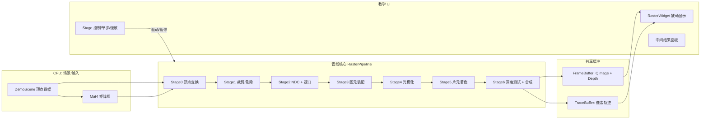
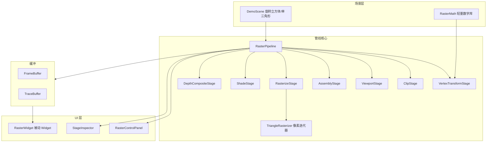

# 软件光栅化管线单元设计文档

> 版本: v0.1 (设计草案)
> 状态: 待评审
> 定位: 教学演示型软件光栅化管线，逐像素绘制，作为 SandBoxEditor 插件体系中的一个可插拔"管线单元"

---

## 1. Overview

### 1.1 目标

在 SandBoxEditor（Qt6 插件架构）中实现一个**完整软件光栅化管线**，以"单像素写入"为最小原语，模拟 GPU 可编程管线的各 Stage，面向**图形学教学演示**：

- 对齐 GPU 管线 Stage：顶点变换 -> 裁剪 -> NDC/视口 -> 图元装配 -> 光栅化 -> 片元着色 -> 深度测试 -> 合成
- 像素级可控：每个像素的写入可单步、慢放、回放，展示算法过程
- 与现有插件体系平级，作为独立可插拔单元（落地形式见第 5 节）

### 1.2 范围

| 包含 | 不包含 |
|---|---|
| MVP 顶点变换（齐次坐标） | GPU/OpenGL 硬件渲染 |
| 视锥剔除 + 近平面裁剪（一期） | 纹理映射/纹理过滤 |
| 透视除法 + NDC -> 视口 | 光照模型体系（仅演示 Lambert） |
| 点 / 线段（Bresenham）/ 三角形（边界函数）光栅化 | 图元分块 Tile-Based 优化 |
| 重心坐标属性插值（Gouraud） | 抗锯齿 MSAA |
| 深度缓冲（z-buffer） | 多线程并行光栅化 |
| 教学演示 UI（单步/慢放/回放/中间结果） | 模型导入（一期不做，可扩展） |

### 1.3 术语

| 术语 | 含义 |
|---|---|
| Stage | 管线中的一个可独立开关/单步的单元 |
| Primitive | 图元（点/线段/三角形），由顶点索引构成 |
| Fragment | 像素级片元，携带屏幕坐标/深度/插值属性 |
| FrameBuffer | 颜色缓冲（QImage）与深度缓冲的组合 |
| TraceBuffer | 像素写入轨迹缓冲，用于教学回放 |

---

## 2. Design

### 2.1 总体架构



### 2.2 管线 Stage 划分

每个 Stage 实现统一接口，可任意**开关 / 单步 / 单独查看输出**，这是"管线单元"的核心语义。

```cpp
// RasterStage.h
class RasterStage
{
public:
    virtual ~RasterStage() = default;
    virtual QString name() const = 0;                 // "顶点变换"
    virtual bool isEnabled() const { return true; }
    virtual void setEnabled(bool) {}
    virtual StageOutput execute(RasterContext& ctx) = 0; // 执行并产出中间结果
};
```

| Stage | 输入 | 输出 | 关键算法 |
|---|---|---|---|
| S0 顶点变换 | 本地坐标顶点 | 裁剪空间顶点 | v_clip = P * V * M * v_local（列向量，右侧先作用） |
| S1 裁剪/剔除 | 裁剪空间图元 | 可见图元 | 背面剔除 + 近平面裁剪（一期），后续补全 6 面 |
| S2 NDC/视口 | 裁剪空间图元 | 屏幕空间图元 | 透视除法 + 视口映射 + y 翻转 |
| S3 图元装配 | 屏幕图元 | Primitive 列表 | 顶点索引 -> 拓扑装配 |
| S4 光栅化 | Primitive 列表 | Fragment 流 | 点/线/三角形逐像素生成 |
| S5 片元着色 | Fragment 流 | 着色后 Fragment | 重心坐标插值（Gouraud/Flat） |
| S6 深度测试+合成 | 着色后 Fragment | FrameBuffer | z-buffer 比较后写像素 |

### 2.3 数据流与数据结构

数据流单向、逐级推进。中间结果对象保留在 `RasterContext` 中，供教学面板查看。

```cpp
// RasterTypes.h
struct RasterVertex               // 顶点（齐次坐标，float 数组便于 SIMD 演进）
{
    float pos[4];                 // x, y, z, w
    float color[4];               // r, g, b, a (0..1)
    float normal[3];              // 演示法线插值
    float uv[2];                  // 预留
};

enum class PrimitiveType { Point, Line, Triangle };

struct RasterPrimitive            // 图元（索引化）
{
    PrimitiveType type;
    QVector<quint32> indices;     // 指向 RasterContext 顶点池
};

struct RasterFragment             // 片元（像素级）
{
    int x, y;                     // 屏幕坐标
    float depth;                  // [0,1]
    float color[4];               // 插值结果
    quint32 primitiveId;          // 归属图元（教学高亮用）
};
```

```cpp
// RasterContext.h —— 贯穿全管线的共享上下文
class RasterContext
{
public:
    FrameBuffer& frameBuffer();
    TraceBuffer& traceBuffer();

    QVector<RasterVertex>& vertices();       // 输入顶点池
    QVector<RasterPrimitive>& primitives();  // 装配后图元
    QVector<StageBuffer>& stageOutputs();    // 各 Stage 中间结果快照
    RasterMatrix& matrices();                // M/V/P/Viewport
    // 教学控制
    int stepGranularity;                     // 0=按Stage 1=按图元 2=按像素
};
```

### 2.4 帧缓冲实现

```cpp
// FrameBuffer.h
class FrameBuffer
{
public:
    void resize(int w, int h);
    void setPixel(int x, int y, const float color[4]); // 唯一像素写入入口
    void clear();

    QImage& colorImage();                 // RGB888，零拷贝显示
    QVector<float>& depthBuffer();        // 并行深度缓冲
    quint64 writeOrder() const;           // 像素写入计数器（回放用）
};
```

**Why FrameBuffer 用 QImage 而非 QPixmap/QPainter：**

| 方案 | 像素级可控 | 性能 | 教学性 | 结论 |
|---|---|---|---|---|
| QImage::scanLine 直接写 | 完全可控 | 快（内存写入） | 强（每像素可插桩） | 采用 |
| QPixmap + QPainter drawLine | 黑盒 | 由 Qt 内部光栅化 | 无（无法展示算法） | 排除 |
| OpenGL | 不适用（像素级教学） | 最快 | 弱（教学主题是软件光栅化） | 排除 |

**Why 深度缓冲用并行 float 数组而非 QImage：** 深度比较是纯数值计算，无需图像语义；并行数组遍历 cache 友好，且便于教学叠加层直接读值显示。

### 2.5 类结构与模块划分



**被动 Widget 设计（推拉结合）：**

- **Push**：管线各 Stage 主动将结果写入 `FrameBuffer` / `TraceBuffer`，Widget 自身不持有任何管线状态
- **Pull**：`RasterWidget::paintEvent` 只做一次 `drawImage(frameBuffer.colorImage())` blit（零拷贝）；控制面板通过信号驱动管线推进，推进后广播 `frameReady` 触发 Widget 重绘

```cpp
class RasterWidget : public QWidget   // 被动 Widget：无状态，只显示
{
protected:
    void paintEvent(QPaintEvent*) override
    {
        QPainter p(this);
        p.drawImage(0, 0, m_frame->colorImage());  // 仅 blit
    }
};
```

**Why 被动 Widget：** 教学场景需要管线完全掌控绘制时序（单步/暂停时 Widget 不得自行重绘），Widget 无状态化保证"数据流向单一、状态无外溢"，符合用户既定架构偏好。

### 2.6 教学演示交互设计

| 控制 | 行为 |
|---|---|
| 运行 / 暂停 | 管线整体推进 / 冻结在当前位置 |
| 单步 Stage | 只执行当前 Stage 一次，高亮侧栏对应项 |
| 单步图元 | 光栅化器只处理下一个 Primitive |
| 单步像素 | 像素迭代器产出下一个 Fragment（逐像素慢放核心） |
| 慢放速度 | 定时器驱动，N 像素/帧，可调 |
| 重放 / 回溯 | TraceBuffer 按写入顺序重放或回退到第 k 个像素 |
| Stage 开关 | 任意禁用某 Stage（如关深度测试观察遮挡错误） |
| 叠加层 | 包围盒 / 扫描线 / 背面剔除状态显示 |

**像素级单步的实现：可暂停迭代器（Token-Driven）**

```cpp
// TriangleRasterizer.h —— 可暂停/可续扫的三角形像素生成器
class TriangleRasterizer
{
public:
    void begin(const RasterPrimitive& prim, const RasterContext& ctx);
    bool nextFragment(RasterFragment& out);   // 每次调用产出 1 个像素
    void reset();
    int pendingCount() const;                 // 剩余像素数（教学显示用）
private:
    // 扫描线状态机：按 y 行推进，行内按 x 推进
    int m_yMin, m_yMax, m_curY, m_curX;
};
```

**Why 迭代器而非一次性产完：** 教学慢放/单步需要"管线状态可悬挂、可续跑"。像素迭代器即"令牌流"，每个 Fragment 是一次令牌产出，天然支持逐步消费——这是"令牌驱动"思想在软件渲染场景的应用。

### 2.7 TraceBuffer 与教学回放

```cpp
struct TracePixel
{
    int x, y;
    int stageId;          // 写入像素的 Stage
    quint32 primitiveId;  // 归属图元
    quint64 order;        // 全局写入序号
    float depth;
};

class TraceBuffer
{
public:
    void record(const TracePixel& p);
    const QVector<TracePixel>& records() const;
    quint64 count() const;
};
```

回放 = 按 `order` 递增逐条重放 `setPixel`，Widget 每次重绘显示前 k 个像素。支持"快进到第 k 像素 / 回退"。

---

## 3. Details

### 3.1 轻量数学库（RasterMath.h）

教学型单元保持自包含，不引入 GLM，自建 header-only 数学（约 200 行）：

```cpp
namespace RasterMath
{
struct Vec3 { float x, y, z; };
struct Vec4 { float x, y, z, w; };

struct Mat4
{
    float m[16];   // 列主序，与 GLM/OpenGL 惯例一致

    static Mat4 identity();
    static Mat4 perspective(float fovY, float aspect, float near, float far);
    static Mat4 lookAt(const Vec3& eye, const Vec3& target, const Vec3& up);
    static Mat4 rotationY(float angle);

    Vec4 transform(const Vec4& v) const;   // v' = M * v
};
}
```

**Why 列主序：** 与业界惯例（OpenGL/GLM）一致，避免后续对照教材/移植代码时的语义错位；矩阵-向量为 `v' = M * v`，变换链 `v * M * V * P` 按局部->世界->相机->裁剪组织。

### 3.2 Stage 实现细节

#### S0 顶点变换

```cpp
// 逐顶点：裁剪空间坐标 = 本地坐标 * Model * View * Projection
for (auto& v : ctx.vertices())
{
    Vec4 clip = mvp.transform(Vec4(v.pos[0], v.pos[1], v.pos[2], v.pos[3]));
    clipVertex[i] = clip;
}
```

教学面板在此 Stage 显示：变换前后顶点表（本地 vs 裁剪坐标），便于对照。

#### S1 裁剪/剔除（一期）

| 规则 | 实现 |
|---|---|
| 背面剔除 | 屏幕空间叉积符号判定（可开关，演示 winding） |
| 近平面裁剪 | 对 z/w < -1 的顶点做 Sutherland-Hodgman 裁剪（保留插值属性） |
| 视锥剔除 | 图元全部顶点同侧于某裁剪面时整体剔除 |

一期只做"背面剔除 + 近平面裁剪"，完整 6 面齐次裁剪列为二期（设计上保留 `ClipStage` 扩展点）。

#### S2 NDC / 视口

```cpp
float ndcX = clip.x / clip.w;
float ndcY = clip.y / clip.w;
float ndcZ = clip.z / clip.w;

int sx = (int)((ndcX * 0.5f + 0.5f) * viewportW);
int sy = (int)((1.0f - (ndcY * 0.5f + 0.5f)) * viewportH);  // y 翻转
float depth = ndcZ * 0.5f + 0.5f;                            // 映射到 [0,1]
```

#### S4 光栅化（管线核心，逐像素）

**点：** 直接写入 1 像素（教学模式画十字标记可开关）。

**线段：Bresenham 整数算法**

```cpp
void rasterizeLine(int x0, int y0, int x1, int y1, RasterContext& ctx)
{
    int dx = abs(x1 - x0), sx = x0 < x1 ? 1 : -1;
    int dy = -abs(y1 - y0), sy = y0 < y1 ? 1 : -1;
    int err = dx + dy;
    for (;;)
    {
        emitFragment(x0, y0, ctx);   // 单像素产出
        if (x0 == x1 && y0 == y1) break;
        int e2 = 2 * err;
        if (e2 >= dy) { err += dy; x0 += sx; }
        if (e2 <= dx) { err += dx; y0 += sy; }
    }
}
```

**Why Bresenham：** 全整数运算、无浮点误差、逐像素产出天然适配迭代器；与教材（《Fundamentals of Computer Graphics》第 3 章）算法一致，便于对照教学。

**三角形：包围盒 + 边界函数（Edge Function）+ 重心坐标插值**

```cpp
// 边界函数：E(x,y) = (x - x0) * (y1 - y0) - (y - y0) * (x1 - x0)
float edge(const Vec2& a, const Vec2& b, const Vec2& p)
{
    return (p.x - a.x) * (b.y - a.y) - (p.y - a.y) * (b.x - a.x);
}

// 光栅化流程（包围盒内逐像素，可暂停）
for (int y = yMin; y <= yMax; ++y)
    for (int x = xMin; x <= xMax; ++x)
    {
        Vec2 p{ (float)x + 0.5f, (float)y + 0.5f };  // 像素中心采样
        float w0 = edge(v1, v2, p);
        float w1 = edge(v2, v0, p);
        float w2 = edge(v0, v1, p);
        if (w0 >= 0 && w1 >= 0 && w2 >= 0)           // 同侧判定
        {
            float area = w0 + w1 + w2;
            emitFragment(x, y, w0/area, w1/area, w2/area, ctx);
        }
    }
```

**Why 边界函数法：** 单指令即可完成内外判定，插值权重（重心坐标）与内外判定复用同一组计算，且可扩展为 MSAA 采样（多像素中心子采样）；比扫描线填充分解法更贴近现代 GPU 光栅化单元的实现方式，教学上"理论 -> 实践"过渡更平滑。

#### S5 片元着色

| 模式 | 规则 | 教学要点 |
|---|---|---|
| Flat | 取图元第一个顶点色 | 对比 Gouraud 理解插值意义 |
| Gouraud | 重心坐标线性插值顶点色 | 展示属性插值原理 |
| Lambert（演示） | 法线插值后 dot(N, L) 光照 | 展示逐片元光照与法线插值误差 |

#### S6 深度测试 + 合成

```cpp
void depthComposite(Fragment& f, FrameBuffer& fb)
{
    if (fb.depthAt(f.x, f.y) > f.depth)      // 更近则覆盖
    {
        fb.setPixel(f.x, f.y, f.color);
        fb.setDepth(f.x, f.y, f.depth);
        fb.recordTrace(f, /*stageId=*/6);
    }
    // 教学：可高亮"被深度拒绝"的像素
}
```

支持教学开关：关闭深度测试 -> 后绘制图元覆盖先绘制（展示可见性错误的直观演示）。

### 3.3 帧缓冲像素写入（唯一入口）

```cpp
// QImage RGB888 直写，避免 setPixelColor 的 QColor 开销
void FrameBuffer::setPixel(int x, int y, const float color[4])
{
    uchar* p = m_color.scanLine(y) + x * 3;
    p[0] = (uchar)(color[0] * 255.0f);
    p[1] = (uchar)(color[1] * 255.0f);
    p[2] = (uchar)(color[2] * 255.0f);
    ++m_writeOrder;
}
```

**性能说明（教学型取舍）：** 单像素函数调用在软件渲染场景是设计意图而非缺陷——目标不是 FPS，而是可观测性。架构上保留"批量写行缓冲"扩展点：教学演示默认逐像素，`FrameBuffer` 预留 `writeScanline()` 供后续性能模式使用。

### 3.4 控制流：教学驱动模型

```cpp
// RasterPipeline::step() —— 教学核心驱动
enum class StepGranularity { ByStage, ByPrimitive, ByPixel };

void RasterPipeline::step()
{
    switch (m_stepGranularity)
    {
    case ByStage:     advanceStage();       break;
    case ByPrimitive: advancePrimitive();   break;
    case ByPixel:     advancePixel();       break;   // 迭代器 nextFragment
    }
    emit frameReady();   // -> 触发 RasterWidget 重绘（Pull）
}
```

### 3.5 演示场景（DemoScene）

| 场景 | 内容 | 教学目的 |
|---|---|---|
| 单三角形 | 3 顶点，大包围盒 | 逐像素单步展示重心坐标/边界函数 |
| 线框立方体 | 12 条线段 | Bresenham 与 MVP 变换 |
| 旋转立方体 | 6 面 12 三角形 + 深度缓冲 | 深度测试/背面剔除/插值着色的综合演示 |
| 双三角形遮挡 | 一前一后 | 关闭深度测试展示遮挡错误 |

---

## 4. 关键设计决策汇总

| 决策 | 选择 | 动机（Why） | 收益（Benefit） |
|---|---|---|---|
| 帧缓冲介质 | QImage 直写像素 | 像素级可控 + 零拷贝显示 | 教学可插桩 + blit 高效 |
| 光栅化算法 | 边界函数/重心坐标 | 与 GPU 光栅化单元同构 | 理论实践平滑过渡 |
| 像素产出方式 | 可暂停迭代器 | 令牌驱动、状态可悬挂 | 慢放/单步/回放统一实现 |
| Widget 形态 | 被动 Widget + blit | 管线完全掌控时序 | 数据单向、无状态外溢 |
| 数学库 | 自建 header-only | 单元自包含、教学可读 | 无第三方依赖 |
| Stage 抽象 | 统一接口可开关 | "管线单元"语义 | 任意单步/开关/查看中间结果 |

---

## 5. 落地形式建议（待定决策点）

| 方案 | 结构 | 优点 | 缺点 |
|---|---|---|---|
| A. 独立插件 | `plugins/RasterPipelineVisualizer/`（含 metadata.json + CMakeLists），与 OctreeVisualizer 并列 | 完全遵循现有插件体系，可独立开关/卸载；DLL 隔离 | 管线核心与 UI 同置于插件内，跨插件复用需另抽库 |
| B. 核心库 + 插件壳 | 管线核心入 `core/` 或独立 `rastercore/` 静态库，插件仅 UI 壳 | 核心可被其他插件复用 | 多一层工程结构，初期收益有限 |

**推荐 A（独立插件）**：当前 OctreeVisualizer 为唯一先例且体量小，无跨插件复用诉求；一期以教学演示为主，独立插件最贴近"管线单元"的独立交付语义。若二期出现多插件共享光栅核心的需求，再按 B 抽取 `rastercore` 静态库，接口不变。

---

## 6. 实施计划（评审通过后执行）

| 阶段 | 内容 | 验证方式 |
|---|---|---|
| P1 | RasterMath + FrameBuffer + RasterContext | 单测：矩阵连乘、视口映射正确性 |
| P2 | S0/S1/S2 + 点/线段光栅化 | 线框立方体渲染正确 |
| P3 | S3/S4 三角形光栅化 + 重心插值 | 单三角形逐像素正确着色 |
| P4 | S5/S6 着色 + 深度测试 | 旋转立方体遮挡正确 |
| P5 | 教学 UI（单步/慢放/回放/Stage 开关/叠加层） | 交互走查 + TraceBuffer 回放一致性 |
| P6 | 集成进 SandBoxEditor 插件体系 | plugins.json 注册、加载/卸载验证 |

---

## 7. 待确认问题

1. 数学库是否接受自建 RasterMath（vs 引入 GLM header-only）？
2. 裁剪一期是否只做近平面 + 背面剔除（完整 6 面裁剪二期）？
3. 是否需要在第一期就预留"批量写行缓冲"性能扩展点？
4. 落地形式是否确认按方案 A（独立插件）执行？
