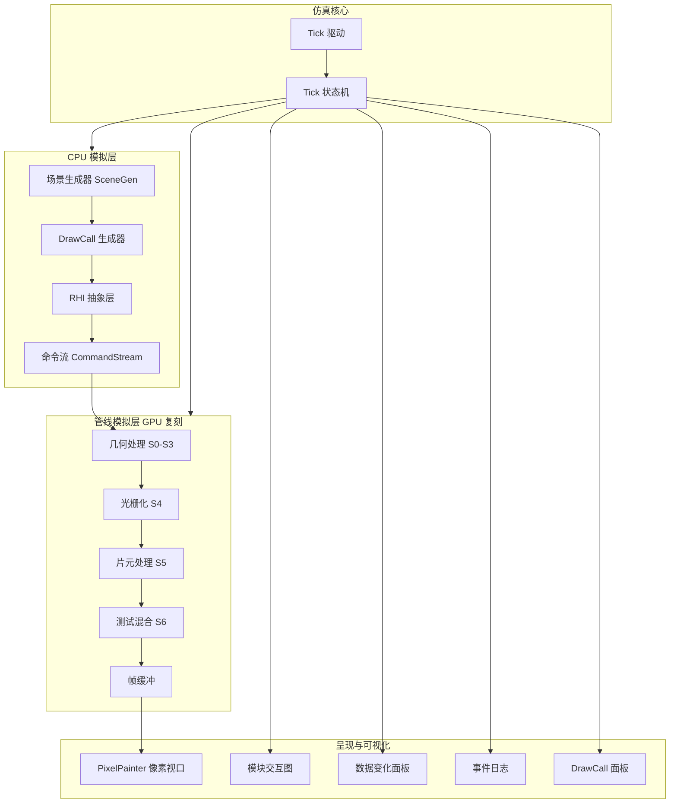
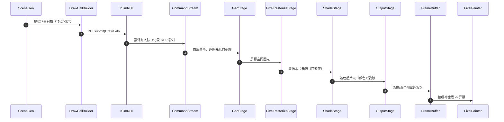
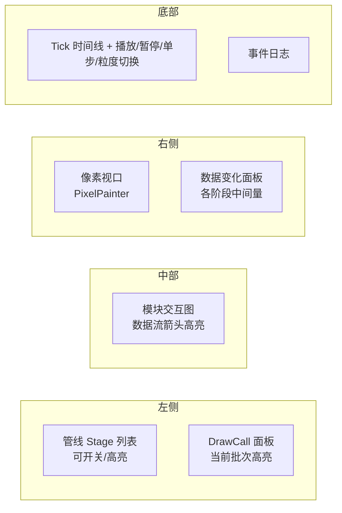
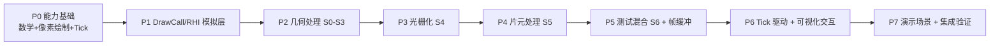
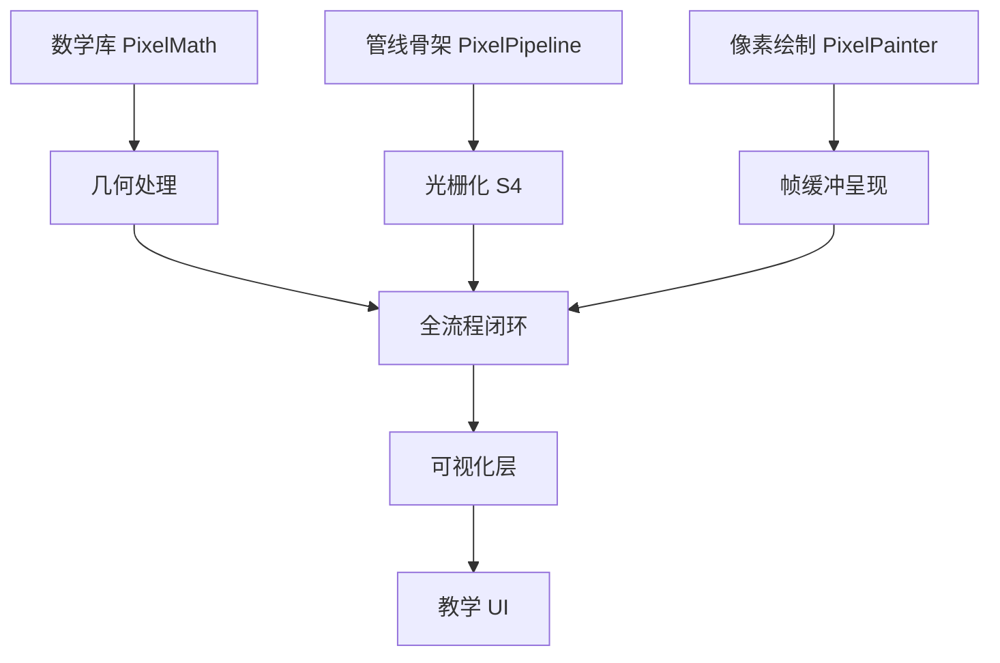

# 模拟 GPU 渲染全流程教学系统设计文档

> 版本: v0.1 (规划草案)
> 状态: 规划评审中
> 定位: 在 CPU 上可观测地复刻"CPU 发出 DrawCall -> RHI 分发 -> GPU 几何处理 -> 光栅化 -> 片元处理 -> 测试混合 -> 帧缓冲 -> 显示"的完整链路，以 Tick 驱动时间，全流程可视化演示
> 关联: 教材《Fundamentals of Computer Graphics 5th》第 9 章；UE 渲染思维导图（GT/RT/RHI 三线程、IA/VS/CLIP/PERSP/VIEW/RAST/EZ/PS/LZ/ROP）
> 前置能力: 窗口像素绘制（PixelPainter 已具备）

---

## 1. 目标与动机

### 1.1 核心目标

把 GPU 的"黑盒工作"在 CPU 上拆开模拟，形成**一个图形从提交到显示的完整数据流演示**：

```
CPU 应用/场景
  -> DrawCall 生成（提交顶点/图元/渲染状态）
  -> RHI 抽象层（模拟不同图形 API 的分发与翻译）
  -> 命令流（简化 Command List）
  -> 几何处理（顶点变换/裁剪/NDC/视口/装配）
  -> 光栅化（顶点离散为片元，逐像素可暂停）
  -> 片元处理（计算颜色与深度）
  -> 测试与混合（深度/混合测试）
  -> 帧缓冲（最终像素）
  -> 呈现（PixelPainter 显示 + 各模块状态可视化）
```

### 1.2 为什么要做这个系统

| 视角 | 现状 | 本系统提供 |
|---|---|---|
| 教学 | 教材讲流程，但 GPU 是黑盒 | 全流程在 CPU 上可逐步拆解、可单步、可观察中间量 |
| 与 UE 对照 | 只知道 UE 有 GT/RT/RHI 线程 | 把"DrawCall -> RHI -> 管线"的每一层在模拟中重现，术语一一对应 |
| 与已有项目 | PixelRenderer 已有像素绘制 + 部分管线 | 升级为完整全流程模拟 + 模块交互可视化 |

### 1.3 范围

| 包含 | 不包含（或二期） |
|---|---|
| CPU 侧 DrawCall 生成与提交 | 真实引擎的多线程并发（GT/RT/RHI 流水线异步） |
| 模拟 RHI 抽象（D3D12/Vulkan/GL 分发概念） | 真实图形 API 调用（本系统是纯 CPU 模拟） |
| 几何处理 S0-S3 | 曲面细分/几何着色器 |
| 光栅化 S4（点/线/三角形） | Tile-Based 分块优化、多线程光栅化 |
| 片元处理 S5（插值着色/Lambert） | 纹理采样/复杂光照 |
| 测试与混合 S6（深度/Alpha） | 模板测试（可预留扩展点） |
| Tick 驱动 + 全流程可视化 | 与真实 GPU 的逐帧对比 |
| 模块交互数据流演示 | 渲染 Pass 级编排（RDG 图） |

---

## 2. 能力基础盘点（从最基础开始）

### 2.1 已具备的能力（可直接复用）

| 能力 | 来源 | 用途 |
|---|---|---|
| 窗口像素绘制 | PixelRenderer/PixelPainter（draw/upload + draw） | 帧缓冲显示 + 任意可视化像素 |
| 数学库 | core/PixelMath（拷贝自 PixelCreator） | 几何处理的 MVP/投影 |
| 模拟管线骨架 | PixelRenderer/PixelPipeline（nextFragment 迭代器） | S4 光栅化逐像素产出 |
| 插件体系 | SandBoxEditor（惰性加载） | 作为独立插件交付 |
| 相机控制 | PixelCreator 相机组件 | 3D 场景观察 |

### 2.2 需要新增的能力

| 能力 | 说明 | 归属模块 |
|---|---|---|
| DrawCall 结构 | 顶点引用 + 拓扑 + 渲染状态 | CPU 模拟层 |
| RHI 抽象 | 接口 + 多实现（模拟分发） | RHI 层 |
| Tick 驱动 | 时间片推进器 + 粒度控制 | 仿真核心 |
| 数据快照 | 各阶段中间量捕获 | 可视化层 |
| 模块交互图 | 模块框 + 数据流高亮 | 可视化层 |
| 事件日志 | DrawCall/阶段进度记录 | 可视化层 |

---

## 3. 总体架构

### 3.1 分层架构



### 3.2 模块划分

按教材理论管线（UE_Rendering_Mind_Consolidated.md 2.1.1）划分为**五大阶段**，每阶段一个独立模块文件夹：

| 阶段 | 模块 | 职责 | 关键类（拟） |
|---|---|---|---|
| 1 应用层 | 场景输入 | 接收输入：构造演示场景数据（立方体/三角形） | SimScene |
| | DrawCall 生成 | 模拟 CPU 处理：场景 -> 渲染批次 | DrawCallBuilder + SimDrawCall |
| | RHI 抽象 | 模拟不同 API 分发与翻译 | ISimRHI + SimRHI_D3D12/Vulkan/GL |
| | 命令流 | 简化的指令队列 | SimCommandStream |
| 2 几何处理 | 几何处理 | 顶点变换(MVP) + VS 光照 + 裁剪/NDC/视口/装配 | GeoStage |
| 3 光栅化 | 光栅化 | 空间顶点离散化为片元 + 属性插值 | PixelRasterizeStage（复用 PixelPipeline） |
| 4 片元处理 | 片元着色 | 计算片元最终颜色与深度 | ShadeStage |
| 5 测试与混合 | 输出 | 深度测试 + Alpha 混合 | OutputStage |
| 帧缓冲（core/） | 帧缓冲 | 颜色 + 深度 + 轨迹 | SimFrameBuffer |
| 核心层 | Tick 驱动 | 时间推进 + 粒度 | TickDriver |
| | 核心调度 | 编排各阶段互相配合 | PipelineOrchestrator |
| UI 层 | 呈现 | GL 像素显示 | PixelPainter（已有） |
| | 可视化 | 交互图/数据面板/日志 | StageDiagram + DataPanel + EventLog |

#### 3.2.1 目录结构（每个阶段一个模块文件夹，无 stages/ 中间层）

```text
plugins/PixelRenderer/
+-- doc/                          # 文档
+-- core/                         # 核心层：类型 + 管线 + 绘制 + 调度 + 帧缓冲
|   +-- PixelTypes.h              # 模块类型：管线层 + 绘制层（已有）
|   +-- PixelPipeline.h/.cpp     # 可暂停光栅化迭代器（已有）
|   +-- PixelPainter.h/.cpp       # GL_POINTS 逐像素绘制（已有）
|   +-- SimFrameBuffer.h          # 帧缓冲（颜色 + 深度 + 轨迹）
|   +-- TickDriver.h              # 时间推进（Tick）
|   +-- PipelineOrchestrator.h    # 核心调度模块（编排各阶段）
|   +-- ISimStage.h               # 阶段统一接口（各阶段模块实现）
|   +-- IPixelPresenter.h         # 呈现接口（PixelPainter 适配实现）
+-- application/                  # 阶段1 应用层：接收输入，CPU 生成 DrawCall
|   +-- SceneGen.h                # 场景输入（顶点/图元）
|   +-- SimDrawCall.h             # 一次绘制调用描述
|   +-- DrawCallBuilder.h         # 场景 -> DrawCall 列表
|   +-- ISimRHI.h                 # RHI 抽象（+ SimRHI_D3D12 / Vulkan / GL）
|   +-- SimCommandStream.h        # 命令流（DrawCall 队列）
+-- geometry/                     # 阶段2 几何处理：顶点变换 + 光照 + 裁剪
|   +-- GeoStage.h                # S0 变换 + VS 光照 + 裁剪/NDC/视口/装配
+-- rasterize/                    # 阶段3 光栅化：空间顶点 -> 片元
|   +-- PixelRasterizeStage.h      # 逐像素离散化 + 属性插值（复用 PixelPipeline）
+-- fragment/                     # 阶段4 片元处理：计算片元颜色/深度
|   +-- ShadeStage.h              # Flat / Gouraud / Lambert
+-- output/                       # 阶段5 测试与混合：深度/Alpha + 帧缓冲写入
|   +-- OutputStage.h             # 深度测试 + Alpha 混合
+-- ui/                           # 教学 UI + 呈现窗口
    +-- PixelWidget.h/.cpp        # 像素呈现窗口（已有）
    +-- StageDiagram.h            # 模块交互图
    +-- DataPanel.h               # 数据变化面板
    +-- EventLog.h                # 事件日志
```

**目录规则**：
- 每个阶段文件夹只暴露**公开接口**给上层；禁止跨阶段直接引用他人内部实现
- 阶段间唯一耦合点 = 数据缓冲（上一阶段 output = 下一阶段 input）
- `core/` 与 `ui/` 是唯二被"全局"引用的模块：核心调度负责编排，绘制模块负责最终呈现

### 3.3 数据流全景（一个 DrawCall 的生命周期）



---

### 3.4 模块化接口与核心调度（已确认架构）

**设计原则**：每个阶段是独立文件夹中的独立模块，只通过接口对外暴露——接收输入数据、产出输出数据；下一阶段用同样的数据流消费。外部由**核心调度模块**统一编排，支持任意阶段手动暂停/开启。

#### 3.4.1 统一阶段接口 ISimStage

```cpp
// core/ISimStage.h —— 所有阶段模块的统一接口
class ISimStage
{
public:
    virtual ~ISimStage() = default;

    virtual QString name() const = 0;              // 阶段名（UI 显示）
    virtual QString describe() const = 0;          // 职责描述

    // 数据进出：从输入缓冲取"一份数据"，处理后产出到输出缓冲
    virtual bool step(SimStageContext& ctx) = 0;   // 返回本 Tick 是否产出了数据

    // 手动暂停/开启（教学核心：停用某阶段观察前后输入输出差别）
    virtual bool enabled() const = 0;
    virtual void setEnabled(bool on) = 0;

    // 输入/输出可观测快照（UI 并排对比展示）
    virtual StageSnapshot snapshot() const = 0;
};
```

#### 3.4.2 数据进出契约

每个阶段持有 `input` / `output` 两个缓冲（由调度器注入），上一阶段的 output 即下一阶段的 input：

```text
Stage[i].input  <- Stage[i-1].output
Stage[i].step() -> 处理一份数据 -> Stage[i].output -> Stage[i+1].input
```

- 数据种类随阶段变化（命令 / 图元 / 片元 / 像素），由类型安全的 `SimStageContext` 承载
- 阶段间唯一耦合 = 数据缓冲；禁止跨阶段调用他人内部实现

#### 3.4.3 核心调度模块 PipelineOrchestrator

```cpp
// core/PipelineOrchestrator.h —— 核心调度：让各阶段互相配合
class PipelineOrchestrator : public QObject
{
    Q_OBJECT
public:
    void addStage(ISimStage* stage);               // 按顺序注册阶段
    void setPresenter(IPixelPresenter* p);         // 注入绘制模块（独立）
    void setTickDriver(TickDriver* driver);        // 注入时间推进器

    void tick();                                   // 推进：驱动当前阶段处理一份数据
    void setStageEnabled(int index, bool on);      // 手动开关某阶段
    ISimStage* stage(int index) const;
    int stageCount() const;

    const QList<StageSnapshot>& snapshots() const; // 各阶段输入/输出快照（UI 拉取）

signals:
    void stageChanged(int index);                  // 阶段状态/数据变化（UI 刷新）
    void frameDone();                              // 一帧完成

private:
    QList<ISimStage*> m_stages;                    // 阶段列表（顺序执行）
    IPixelPresenter* m_presenter = nullptr;        // 绘制模块（独立注入）
};
```

**每个 Tick 的调度逻辑**：
1. 找到第一个 `enabled` 且"输入就绪"的阶段
2. 调用其 `step()` 处理一份输入数据
3. 把产出写入下一阶段的输入缓冲
4. 广播 `stageChanged`，UI 刷新该阶段的输入/输出对比
5. 若某阶段被禁用，其数据**直接透传**（input -> output 旁路），便于观察"少了这一步会怎样"

**Why 手动暂停/开启**：教学演示"各阶段输入输出差别"的最直接手段——
- 禁用光栅化：看"没有片元，下游全空"
- 禁用深度测试：看"遮挡错误"
- 禁用着色：看"无颜色（默认色）"
- 禁用 RHI：看"DrawCall 未被翻译"

---

## 4. 核心概念：Tick 驱动时间模型

### 4.1 为什么用 Tick

真实 GPU 是海量并行，没有"步骤"可言；我们在 CPU 上模拟，天然串行。Tick 就是把串行推进**切成可观测的时间片**，每个 Tick 只做一件事，方便逐步演示。

### 4.2 Tick 粒度

| 粒度 | 每个 Tick 推进的内容 | 教学用途 |
|---|---|---|
| ByDrawCall | 处理 1 个 DrawCall 的全部 | 观察"一个批次走完管线" |
| ByStage | 推进 1 个管线 Stage | 观察各阶段交接数据 |
| ByPrimitive | 处理 1 个图元 | 观察图元级行为 |
| ByPixel | 产出/处理 1 个片元 | 逐像素教学（最细） |

### 4.3 时间轴模型

```
tick:  |  0  |  1  |  2  |  3  | ... |  N  |  0  |  1  | ...
帧:       [--------- 帧 0（多个 Tick）----------][ 帧 1 ]
```

- 一"帧" = 若干 Tick（数量由粒度和场景大小决定）
- 每个 Tick 结束后广播 `ticked(tickIndex)`，所有可视化面板刷新
- `frameCompleted(frameIndex)` 表示一帧的像素全部产出

### 4.4 TickDriver 设计

```cpp
// TickDriver.h —— 仿真核心时间推进器
class TickDriver : public QObject
{
    Q_OBJECT
public:
    enum class Granularity { ByFrame, ByDrawCall, ByStage, ByPrimitive, ByPixel };

    void setGranularity(Granularity g);
    void tick();               // 手动推进一个时间片（单步）
    void play();               // 定时器连续推进
    void pause();
    void reset();              // 回到帧起始

    quint64 tickIndex() const;
    int frameIndex() const;

signals:
    void ticked(quint64 tickIndex);       // 每个 Tick 后发出（可视化刷新）
    void frameCompleted(int frameIndex);  // 一帧完成
    void stageEntered(int stageId);       // 进入某 Stage（模块高亮）

private:
    Granularity m_granularity = Granularity::ByPixel;
    quint64 m_tick = 0;
    int m_frame = 0;
    QTimer m_timer;                        // play 模式用
};
```

**关键点**：Tick 是唯一的"推进源"。所有模块状态的变化都发生在某个 Tick 内，可视化层只响应 `ticked` 信号——这就是"推拉结合"在仿真层的体现。

---

## 5. 模块详细设计

> 各阶段模块统一实现 §3.4 的 `ISimStage` 接口（接收输入、产出输出、可手动开关）；
> 绘制模块独立实现 `IPixelPresenter` 接口（§5.9）；核心调度见 §3.4.3。

### 5.1 CPU 模拟层：DrawCall 生成器

模拟"CPU 场景 -> 渲染批次"：

```cpp
// SimDrawCall.h —— 一次绘制调用的完整描述
struct SimDrawCall
{
    QString name;                       // "Cube" / "Ground" 等（教学标识）
    int vertexOffset;                   // 顶点池中的起始偏移
    int vertexCount;                    // 顶点数量
    PixelPrimitiveType topology;             // 点/线/三角形
    QVector<quint32> indices;           // 索引（可选）
    bool depthTest = true;              // 渲染状态：深度测试开关
    float alphaBlend = 1.f;             // 渲染状态：混合因子（教学用）
};

// DrawCallBuilder.h —— 把场景对象转成 DrawCall 列表
class DrawCallBuilder
{
public:
    void buildFromScene(const SimScene& scene);      // 场景 -> DrawCall 列表
    const QVector<SimDrawCall>& drawCalls() const;   // 产出结果
    int count() const;
};
```

### 5.2 RHI 抽象层（模拟不同 RHI 分发）

核心教学点：**同一 DrawCall，不同 RHI 用"不同函数"处理，但最终都发给管线执行**。

```cpp
// ISimRHI.h —— 模拟图形 API 抽象
class ISimRHI
{
public:
    virtual ~ISimRHI() = default;
    virtual QString name() const = 0;               // "D3D12" / "Vulkan" / "OpenGL"
    virtual QString describe(const SimDrawCall&) const = 0;   // 该 RHI 的"翻译动作"描述

    virtual void submit(const SimDrawCall& dc, SimCommandStream& out) = 0;
};

// 模拟 D3D12：记录到命令列表 -> 提交执行队列
class SimRHI_D3D12 : public ISimRHI
{
public:
    QString name() const override { return QStringLiteral("D3D12"); }
    QString describe(const SimDrawCall& dc) const override
    {
        return QStringLiteral("ID3D12GraphicsCommandList::DrawIndexedInstanced(%1)")
            .arg(dc.indexCount());
    }
    void submit(const SimDrawCall& dc, SimCommandStream& out) override;
};

// 模拟 Vulkan：记录到命令缓冲 -> vkQueueSubmit
class SimRHI_Vulkan : public ISimRHI { /* 同构，describe 用 vkCmdDraw 语义 */ };

// 模拟 OpenGL：立即模式 glDrawElements（概念对照，非真实调用）
class SimRHI_GL : public ISimRHI { /* 同构，describe 用 glDrawElements 语义 */ };
```

**Why 抽象 RHI**：教学上让学生看到"引擎换 API 只是换翻译层，管线本体不变"——这正是 UE 的 RHI 层存在的意义。

### 5.3 命令流（简化 Command List）

```cpp
// SimCommandStream.h —— 简化的指令队列
struct SimCommand
{
    QString rhiName;        // 来自哪个 RHI
    QString action;         // 翻译动作描述（"vkCmdDraw / DrawIndexedInstanced..."）
    int drawCallIndex;      // 对应 DrawCall
};

class SimCommandStream
{
public:
    void push(const SimCommand& cmd);
    bool pop(SimCommand& out);          // 取出一条供管线处理
    int pending() const;                // 剩余命令数（教学显示）
};
```

### 5.4 几何处理 S0-S3（GeoStage）

| 子阶段 | 教材/UE 术语 | 工作 |
|---|---|---|
| S0 顶点变换 + VS 光照 | VS | v_clip = P * V * M * v_local（复用 PixelMath）；Gouraud 顶点光照计算，光照颜色随顶点输出 |
| S1 裁剪/剔除 | CLIP | 近平面裁剪 + 背面剔除 |
| S2 NDC/视口 | PERSP + VIEW | 透视除法 + 视口映射 + y 翻转 |
| S3 装配 | IA | 顶点索引 -> 图元拓扑 |

> 阶段职责（教材理论管线）：**顶点变换 + 光照计算**，并向光栅化阶段传递裁剪后的空间顶点。

```cpp
// GeoStage.h —— 几何处理：输入 DrawCall 顶点，输出屏幕空间图元
class GeoStage
{
public:
    void process(const SimCommand& cmd, const PixelVertex* vertexPool,
                 QVector<PixelPrimitive>& outPrims);
    // 中间量快照（供可视化）：每个顶点变换前后坐标
    const StageSnapshot& snapshot() const;
};
```

### 5.5 光栅化 S4（PixelRasterizeStage）

复用/扩展 PixelPipeline 的可暂停迭代器：

```cpp
// PixelRasterizeStage.h —— 图元 -> 片元流（逐像素可暂停，含重心坐标属性插值）
class PixelRasterizeStage
{
public:
    void begin(const QVector<PixelPrimitive>& prims);
    bool nextFragment(PixelFragment& out);    // 每 Tick 产出 1 个片元
    int pendingCount() const;                 // 剩余片元数（进度显示）
};
```

### 5.6 片元处理 S5（ShadeStage）

```cpp
// ShadeStage.h —— 片元着色：颜色 + 深度计算
class ShadeStage
{
public:
    enum class Mode { Flat, Gouraud, Lambert };   // 着色模式（教学切换）

    void setMode(Mode m);
    void process(PixelFragment& f) const;           // 计算最终颜色/深度
    // 教学：展示重心坐标权重、法线插值等中间量
    const ShadeDebug& debugInfo() const;
};
```

### 5.7 测试与混合 S6（OutputStage）

对齐 GPU 的 EZ（提前深度）/ LZ（延迟深度）概念：

```cpp
// OutputStage.h —— 深度测试 + Alpha 混合，写入帧缓冲
class OutputStage
{
public:
    void setDepthTestEnabled(bool on);      // 教学开关（关掉演示遮挡错误）
    void setAlphaBlend(float factor);
    bool composite(PixelFragment& f, SimFrameBuffer& fb);  // 通过则写入，返回是否写入
};
```

**教学亮点**：展示 EZ 与 LZ 的概念差异——模拟中可标记"提前深度拒绝"的片元（未进 PS 就被剔除）与"延迟深度拒绝"的片元（PS 计算后被剔除），让学生理解 GPU 优化。

### 5.8 帧缓冲（SimFrameBuffer）

```cpp
// SimFrameBuffer.h —— 颜色 + 深度 + 像素轨迹
struct SimFrameBuffer
{
    int width, height;
    QVector<float> color;      // RGB 每像素 3 分量
    QVector<float> depth;      // 深度缓冲（初始化远平面最大值）
    QVector<TracePixel> trace; // 像素写入轨迹（回放用）
};
```

### 5.9 绘制模块（独立，暴露接口）

绘制模块与其他阶段**解耦独立**——它不参与管线数据流，只负责把帧缓冲"呈现"到屏幕。对外只暴露一个接口，内部实现可替换（GL_POINTS / QImage / 未来 OpenGL 纹理）。

```cpp
// core/IPixelPresenter.h —— 呈现接口（对外暴露）
class IPixelPresenter
{
public:
    virtual ~IPixelPresenter() = default;
    virtual QString name() const = 0;                 // "GL_POINTS" / "QImage" 等

    virtual void present(const SimFrameBuffer& fb) = 0;  // 把帧缓冲画到屏幕
    virtual void clear() = 0;                         // 清屏
    virtual void resize(int w, int h) = 0;            // 网格/视口跟随窗口
};

// core/PixelPainter.h —— 现有实现，统一入口 draw(DrawCommand)
// 呈现原语：draw(DrawCommand) 画点/画线（命令自包含，含目标尺寸）
// 当前为独立类（draw/upload/draw/count）；后续用适配器包一层实现 IPixelPresenter
class PixelPainter { /* 已实现 */ };
```

**Why 独立 + 接口**：
- 管线侧不关心"像素怎么显示"，只把 `SimFrameBuffer` 交给 presenter
- 呈现原语统一为 `DrawCommand`（**呈现层命令**，非管线提交命令；管线产物经 `drawFragment` 进入）
- 未来可加"QImage 呈现器"做 CPU/GL 双模式对比（教学）
- 符合推拉结合：管线推数据到帧缓冲，presenter 拉出来绘制

---

## 6. 数据流与数据契约

### 6.1 阶段间数据结构（复用/扩展）

| 阶段间 | 数据结构 | 状态 |
|---|---|---|
| DrawCall -> RHI | SimDrawCall | 新增 |
| RHI -> 命令流 | SimCommand | 新增 |
| 命令流 -> 几何 | PixelVertex 池 + SimCommand | 复用/扩展 |
| 几何 -> 光栅化 | PixelPrimitive 列表 | 复用 |
| 光栅化 -> 片元 | PixelFragment 流 | 复用 |
| 片元 -> 输出 | PixelFragment（含深度） | 复用 |
| 输出 -> 帧缓冲 | 像素写入 + 轨迹 | 复用/扩展 |

### 6.2 数据快照（供可视化）

```cpp
// StageSnapshot.h —— 每个模块对外暴露的观测数据
struct StageSnapshot
{
    int stageId;                 // 模块标识
    QString stageName;           // 模块名称
    QString state;               // 当前状态描述（"等待输入"/"处理中"/"完成"）
    QVector<QString> inputSummary;   // 输入数据摘要（供面板显示）
    QVector<QString> outputSummary;  // 输出数据摘要
    int processedCount = 0;      // 已处理数量（片元数/图元数/命令数）
    quint64 lastTick = 0;        // 最近一次变化的 Tick（高亮动画用）
};
```

### 6.3 接口契约（机器可读）

| 能力 ID | 功能 | 输入 | 输出 | 调用示例 |
|---|---|---|---|---|
| SC_BUILD | 生成场景 | 场景描述 | DrawCall 列表 | `builder.buildFromScene(scene)` |
| RHI_SUBMIT | RHI 提交 | DrawCall | SimCommand | `rhi->submit(dc, stream)` |
| TICK_STEP | 推进一个 Tick | 无 | 无（广播信号） | `driver.tick()` |
| GEO_PROCESS | 几何处理一个命令 | SimCommand | 图元列表 | `geo.process(cmd, pool, out)` |
| RAST_PIXEL | 产出下一个片元 | 无 | PixelFragment | `rast.nextFragment(f)` |
| SHADE_FRAG | 片元着色 | PixelFragment | 着色后片元 | `shade.process(f)` |
| OUT_COMPOSITE | 测试+混合 | PixelFragment | 是否写入 | `out.composite(f, fb)` |
| FB_RENDER | 呈现帧缓冲 | SimFrameBuffer | 屏幕像素 | `painter.render()` |
| STAGE_STEP | 阶段处理一份数据 | 阶段索引 | 是否产出 | `stage->step(ctx)` |
| STAGE_TOGGLE | 手动暂停/开启阶段 | 阶段索引 + bool | 无 | `orchestrator.setStageEnabled(i, on)` |
| ORCH_TICK | 核心调度推进 | 无 | 无（广播 stageChanged） | `orchestrator.tick()` |
| PRESENT_DRAW | 绘制帧缓冲 | SimFrameBuffer | 屏幕 | `presenter->present(fb)` |

| 能力 ID | 错误处理 |
|---|---|
| RAST_PIXEL | 迭代器耗尽返回 false，TickDriver 停止推进 |
| OUT_COMPOSITE | 深度失败返回 false（可统计"被拒绝片元数"） |
| TICK_STEP | 场景为空时直接广播 frameCompleted 并重置 |

---

## 7. 可视化与交互设计

### 7.1 整体布局（教学演示界面）



### 7.2 模块交互图（核心可视化）

- 每个模块绘制为一个"框"，框内显示当前 `StageSnapshot`（状态 + 计数）
- 模块间连线表示数据流，**数据传递时连线高亮动画**（Tick 驱动）
- 当前活动 Stage 的框高亮边框
- **输入/输出对比**：每个框左右并排展示 `inputSummary` 与 `outputSummary`，一眼看清"这个阶段吃进什么、吐出什么"；阶段被禁用时框置灰并标注"已旁路"
- 用 QGraphicsView 或简化 QWidget 布局实现（二期可升级 QML）

### 7.3 DrawCall 呈现

- 列出所有 DrawCall（名称 + 拓扑 + 渲染状态）
- 当前被 RHI 处理的 DrawCall 高亮，并显示该 RHI 的"翻译动作"描述
- 切换 RHI 实现时，翻译动作文本随之变化（演示 API 差异）

### 7.4 控制与教学交互

| 控制 | 行为 |
|---|---|
| 播放/暂停 | Tick 定时器推进 / 冻结 |
| 单步 | 手动 `driver.tick()` 推进一个时间片 |
| 粒度切换 | ByDrawCall / ByStage / ByPrimitive / ByPixel |
| 重置 | `driver.reset()` + 清空帧缓冲 |
| RHI 切换 | 换 ISimRHI 实现（D3D12/Vulkan/GL） |
| 着色模式 | Flat / Gouraud / Lambert |
| 深度开关 | 关闭深度测试演示遮挡错误 |
| 回放 | 按像素轨迹重放帧缓冲写入 |

---

## 8. 计划图

### 8.1 总计划



### 8.2 依赖与并行



---

## 9. 工作分解

### 9.1 阶段与任务

| 阶段 | 内容 | 如何开展 | 验证方式 |
|---|---|---|---|
| P0 | 能力基础盘点（数学/像素绘制/Tick 基础） | 复用现有，补齐 TickDriver 雏形 | 单测 Tick 推进正确 |
| P1 | DrawCall 结构 + RHI 抽象 + 命令流 | 定义 SimDrawCall / ISimRHI / SimCommandStream | 单测：同一 DC 经三种 RHI 产生不同 describe |
| P2 | GeoStage（S0-S3） | 复用 PixelMath 实现变换/裁剪/视口 | 单测：顶点变换前后坐标正确 |
| P3 | PixelRasterizeStage（S4） | 扩展 PixelPipeline 迭代器 | 单测：线/三角形片元集合正确 |
| P4 | ShadeStage（S5） | 实现 Flat/Gouraud/Lambert | 单测：端点/中心颜色正确 |
| P5 | OutputStage（S6）+ SimFrameBuffer | 深度/混合 + 轨迹记录 | 单测：遮挡正确、轨迹可回放 |
| P6 | TickDriver 接线 + 可视化层 | 模块交互图/数据面板/日志/DrawCall 面板 | 交互走查：单步/慢放/回放一致 |
| P7 | 演示场景 + 插件集成 | 立方体场景 + 三种 RHI 切换演示 | plugins.json 注册、加载/卸载验证 |

### 9.2 关键顺序决策

1. **先闭环再美化**：P1-P5 目标是"一条 DrawCall 走完管线、像素上屏"，先保证数据正确；可视化（P6）只是把已有的 StageSnapshot 显示出来
2. **Tick 与管线解耦**：TickDriver 只发信号，管线各 Stage 不感知 Tick——便于以后换真实时钟
3. **数据契约先行**：SimDrawCall/PixelFragment/StageSnapshot 一旦定型，各 Stage 独立开发

### 9.3 复用清单

| 复用对象 | 来源 | 直接用于 |
|---|---|---|
| PixelPainter | PixelRenderer | 帧缓冲呈现 |
| 数学库 | PixelCreator | 几何处理 |
| PixelPipeline 迭代器 | PixelRenderer | 光栅化 |
| 相机组件 | PixelCreator | 3D 场景预览 |

---

## 10. 风险与取舍

| 风险/取舍 | 说明 | 对策 |
|---|---|---|
| 模拟与真实 GPU 差异 | 串行模拟无法体现并行性能 | 明确教学定位：讲"流程与数据"，不讲"性能" |
| 可视化开发量大 | 交互图/面板/QGraphics 复杂度高 | P6 独立成阶段，先静态布局后动画 |
| 概念过载 | 术语太多（RHI/命令流/EZ/LZ...） | 每个术语在 UI 上提供 tooltip/对照表 |
| 与真实引擎脱节 | 模拟的 RHI 不是真 API | 保留"对照真实语义"的 describe 文本，链接 UE 源码概念 |

---

## 11. 与 UE 概念对照表

| 本系统模块 | UE 对应 | 教材/GPU 对应 |
|---|---|---|
| DrawCallBuilder | MeshDrawCommand（RT 线程录制） | 应用程序阶段提交绘制指令 |
| ISimRHI 分发 | RHI 线程翻译（D3D12/Vulkan 后端） | API 层 |
| SimCommandStream | RDG 命令提交 | 命令队列 |
| GeoStage | FPrimitiveSceneProxy -> 顶点着色 | IA / VS / CLIP / PERSP / VIEW |
| PixelRasterizeStage | 光栅化（硬件） | RAST |
| ShadeStage | BasePass 片元着色 | PS |
| OutputStage | Depth/Blend State | EZ / LZ / ROP |
| SimFrameBuffer | SceneColor + Depth | 帧缓冲 |
| PipelineOrchestrator | 渲染器编排（RenderGraph 执行） | 管线驱动 |
| ISimStage（阶段接口） | 渲染 Pass 抽象 | 阶段单元 |
| IPixelPresenter（呈现接口） | Present / 显示代理 | 输出合并后的显示 |
| TickDriver | RenderThread 帧循环 | CPU-GPU 流水线节拍 |

---

## 12. 决策记录与待确认

### 12.1 已确认架构决策

| 决策项 | 结论 | 影响位置 |
|---|---|---|
| 模块组织 | 五大阶段各一个模块文件夹（无 stages/ 中间层），只暴露接口 | §3.2.1 目录结构 |
| 数据进出 | 模块接收输入数据、产出输出数据，下一阶段同流程消费 | §3.4.2 |
| 核心调度 | PipelineOrchestrator 统一编排各阶段 | §3.4.3 |
| 阶段控制 | 支持任意阶段手动暂停/开启（禁用即透传） | §3.4 |
| 绘制模块 | 独立（core/），暴露 IPixelPresenter 接口 | §5.9 |
| 输入输出对比 | 每阶段快照含 input/output 摘要，UI 并排展示 | §7.2 |

### 12.2 建议决策

| 决策项 | 建议 | 理由 |
|---|---|---|
| 落地形式 | 扩展 PixelRenderer 或新插件 GPUSimulator | 见 12.3 |
| 呈现层 | 继续用 PixelPainter（GL_POINTS） | 已具备、零成本 |
| 深度处理 | CPU z-buffer（与现有决策一致） | 教学语义完整 |
| 着色模式 | Flat/Gouraud/Lambert 三选一教学切换 | 覆盖教材两种着色频率 |

### 12.3 待确认问题

1. 本系统是**扩展 PixelRenderer**（在其内新增模拟层）还是**新建独立插件**（如 `plugins/GPUSimulator`）？
2. 可视化交互图用 **QGraphicsView（轻量）** 还是 **QML（重但漂亮）**？
3. RHI 模拟做三种（D3D12/Vulkan/GL）还是先做一种 + 可插拔接口？
4. Tick 粒度默认值设为哪个（建议 ByPixel，教学最细）？
