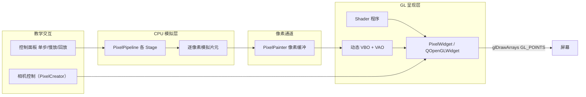

# 基于 OpenGL 逐像素绘制的模拟光栅化管线设计文档

> 版本: v0.1 (设计草案)
> 状态: 待评审
> 定位: 使用 OpenGL 接口绘制单个像素点，并基于此能力设计完整的模拟光栅化流程，作为 SandBoxEditor 插件体系中的一个教学演示单元

---

## 1. Overview

### 1.1 目标

在 SandBoxEditor 中新增 **PixelRenderer** 插件，核心能力是"**用 OpenGL 接口绘制像素点**"，并基于该能力构建**完整的模拟光栅化管线**：

- 呈现层：通过 OpenGL（QOpenGLWidget + Core Profile）把每一个模拟片元绘制为一个像素点
- 模拟层：CPU 端模拟光栅化管线各 Stage（顶点变换 -> 裁剪 -> NDC/视口 -> 光栅化 -> 着色 -> 深度合成），逐像素产出片元
- 教学性：每个像素的产出可单步、慢放、回放，且能在屏幕上以 GL 点的方式直观呈现

### 1.2 与 PixelCreator（QImage 软件光栅化）的关系

| 维度 | PixelCreator | PixelRenderer（本文档） |
|---|---|---|
| 呈现介质 | QImage + QPainter blit | OpenGL 点绘制（GL_POINTS） |
| 像素产出 | CPU 软件光栅化 | CPU 模拟光栅化（相同算法思想） |
| GL 依赖 | 无 | QOpenGLWidget + GLSL shader |
| 教学侧重 | 纯软件流程可观测 | GL 呈现 + 软件模拟对照 |
| 深度测试 | CPU z-buffer | CPU z-buffer（仅，不接 GL depth test） |

两者共享同一套"模拟光栅化"的算法设计（顶点变换/裁剪/光栅化/插值），差异仅在**最终呈现介质**。PixelRenderer 提供了一条"同一管线、GL 呈现"的对照视角。

### 1.3 范围

| 包含 | 不包含 |
|---|---|
| QOpenGLWidget + Core Profile 3.3 上下文 | 使用现代 GPU 硬件光栅化代替模拟流程 |
| GL_POINTS 逐像素点绘制（1px 点） | glDrawPixels（Legacy 接口，Core Profile 已移除） |
| CPU 端模拟光栅化管线全流程 | 纹理映射 / 光照模型体系 |
| 像素流缓冲 + 动态 VBO 批量提交 | 多线程并行光栅化 |
| 教学交互（单步/慢放/回放/叠加层） | Tile-Based 分块优化 |
| CPU z-buffer（仅） | 抗锯齿 MSAA（1px 点不适用） |

### 1.4 术语

| 术语 | 含义 |
|---|---|
| 模拟片元 | CPU 模拟管线产出的"像素级结果"，含坐标/颜色/深度 |
| GL 像素点 | 一个 `GL_POINTS` 图元，映射到屏幕 1 个物理像素 |
| 像素流 | 模拟片元的序列缓冲，是 CPU 模拟层与 GL 呈现层的唯一数据通道 |
| Presenter | GL 呈现组件，负责把像素流提交给 GPU 并显示 |

---

## 2. Design

### 2.1 总体架构



数据流单向：CPU 模拟管线逐像素产出片元 -> 追加进像素流 -> 每帧上传 VBO -> `glDrawArrays(GL_POINTS)` 一次性绘制全部像素点。

### 2.2 呈现策略对比与选型

| 策略 | 逐像素语义 | Core Profile 可用 | 性能 | 教学性 | 结论 |
|---|---|---|---|---|---|
| GL_POINTS 点绘制 | 每像素=1 点，天然对齐 | 可用 | 批量绘制高效 | 强（单步=加 1 点） | **采用** |
| 纹理上传 + 全屏四边形 | 弱（像素是纹理数据，非"点"） | 可用 | 最高 | 中（逐步感弱） | 备选 |
| glDrawPixels | 强 | 不可用（已移除） | 低 | 强 | 排除 |

**Why 选 GL_POINTS：** 教学目标是"看到每一个像素被画出来"。`GL_POINTS` 让每个模拟片元对应一个可独立追踪的 GL 图元：单步执行 = 追加 1 个点，回放 = 只提交前 k 个点。纹理方案虽然性能更好，但"像素"退化为纹理数据，无法体现逐像素语义。

### 2.3 像素流数据契约

模拟层与 GL 呈现层通过像素流解耦，数据结构：

```cpp
// core/PixelTypes.h（一、管线层类型）—— CPU 模拟层产出的像素级结果
struct PixelFragment
{
    int x, y;              // 帧缓冲像素坐标（左上角原点，y 向下）
    float color[4];        // RGBA（0..1）
    float depth;           // 模拟深度 [0,1]（CPU z-buffer 使用）
    quint32 primitiveId;   // 归属图元（教学高亮用）
    quint64 order;         // 全局产出序号（回放用）
};

// core/PixelPainter.h —— 像素绘制器：封装画像素图元的全部 GL 样板
// 核心设计：一次绘制 = 一条自包含命令（DrawCommand），目标尺寸随命令携带
struct PixelColor
{
    float r, g, b;       // RGB 颜色（0..1）
    float a;             // 透明度 alpha（0..1，需 GL_BLEND 可见）
    float brightness;    // 亮度（0..1，乘入 RGB；1=原色，0=黑色）
};

struct DrawCommand        // 一次绘制所需全部信息（自包含，参考 DrawCall/命令概念）
{
    PixelPrimitiveType type;   // 图元类型：点 / 线（未来三角形）
    int x0, y0;           // 起点坐标（点只用起点）
    int x1, y1;           // 终点坐标（线用）
    PixelColor color;     // 颜色 + 透明度 + 亮度
    int targetW, targetH; // 渲染目标尺寸（窗口 / 像素网格）
    // 便捷构造：makePoint(x,y,color,w,h) / makeLine(x0,y0,x1,y1,color,w,h)
};

class PixelPainter
{
public:
    void draw(const DrawCommand& cmd);   // 统一入口：一条命令 = 一次绘制
    void drawFragment(const PixelFragment& f, int targetW, int targetH);  // 便捷：接受模拟片元
    void clear();                        // 清空缓冲
    void upload();                       // 将缓冲上传到 VBO
    void draw();                         // glDrawArrays(GL_POINTS, 0, count)
    int count() const;                   // 当前像素点数
    // 内部：appendPixel 写 1 像素；plotPoint 直接写点，plotLine 用 Bresenham 逐点调 appendPixel
    // 内部：QVector<float> m_data; 交错 {x_ndc, y_ndc, r, g, b, a}，每点 24 字节
};
```

**绘制能力分层（先画点，再画线，组合成任意图形）：**

```text
draw(DrawCommand) 统一入口
  +-- type=Point   -> plotPoint  -> appendPixel（1 像素）
  +-- type=Line    -> plotLine   -> Bresenham 逐点 appendPixel（画线建立在画点之上）
  +-- type=Triangle（未来） -> 边界函数填充
```

- 目标尺寸**不再单独存储**在绘制器中，由每条 `DrawCommand` 携带（天然防除零、命令自包含）
- 点 + 线 两种原语可组合绘制任意复杂图形（多边形网格 / 线框 / 文字等）

**层级定位（重要）**：`DrawCommand` 是**呈现层原语命令**，不是管线提交命令。

| 层级 | 概念 | 位置 |
|---|---|---|
| 管线层 | `SimDrawCall`（批次）-> `SimCommand`（RHI 翻译）-> 顶点/图元走 S0-S6 | 管线**上游入口** |
| 呈现层 | `DrawCommand`（画点/画线原语） | 管线**下游出口** |

- 正式接缝 = `drawFragment(f)`：管线产出 `PixelFragment` -> 呈现层包装成 Point 命令画出来
- 直接调用 `painter.draw(makePoint(...))` 是**绕过管线**的立即绘制（测试/调试用）
- 可选扩展：为 `DrawCommand` 增加渲染状态字段（`depthTest` / `blend`），使其更接近 OutputStage 的输入描述

### 2.4 模拟光栅化管线（CPU Stage 划分）

管线核心与 PixelCreator 设计一致，逐像素产出片元，差异在产出去向（写入像素流而非 QImage）：

| Stage | 输入 | 输出 | 关键算法 |
|---|---|---|---|
| S0 顶点变换 | 本地坐标顶点 | 裁剪空间顶点 | v_clip = P * V * M * v_local（列向量，右侧先作用） |
| S1 裁剪/剔除 | 裁剪空间图元 | 可见图元 | 背面剔除 + 近平面裁剪 |
| S2 NDC/视口 | 裁剪空间图元 | 屏幕空间图元 | 透视除法 + 视口映射 + y 翻转 |
| S3 图元装配 | 屏幕图元 | Primitive 列表 | 顶点索引 -> 拓扑 |
| S4 光栅化 | Primitive 列表 | 模拟片元流 | 点/线(Bresenham)/三角形(边界函数) 逐像素 |
| S5 片元着色 | 模拟片元流 | 着色后片元 | 重心坐标插值（Flat/Gouraud） |
| S6 深度合成 | 着色后片元 | 最终像素 | CPU z-buffer 比较 |

教学核心是 S4：光栅化器以**可暂停迭代器**逐像素产出（令牌驱动），每产出 1 个 `PixelFragment` 就：

```cpp
// 单步模式：产出 1 个像素 -> 画 1 个像素 -> 立即重绘
bool ok = pipeline.nextFragment(frag);   // 产出下一个模拟片元
if (ok)
{
    painter.drawFragment(frag, w, h);      // 画 1 像素（目标尺寸随命令）
    painter.upload();                      // 上传 VBO
    update();                              // 触发 paintGL
}
```

### 2.5 GL 呈现层组件

```cpp
// ui/PixelWidget.h —— 教学像素呈现窗口（被动 Widget）
class PixelWidget : public QOpenGLWidget
{
    Q_OBJECT
public:
    void setPipeline(PixelPipeline* pipeline);  // 注入模拟管线（外部拥有）
    void stepPixel();        // 单步：管线产出 1 片元并绘制
    void runPipeline();      // 运行：管线跑完全部像素
    void replayTo(quint64 order);  // 回放定位（仅改变绘制数量）
    void clearScreen();      // 清空像素并重绘
protected:
    void initializeGL() override;   // 编译 shader、初始化绘制器（VAO/VBO）
    void paintGL() override;        // 上传像素并 glDrawArrays(GL_POINTS)
    void resizeGL(int w, int h) override;  // 更新视口与渲染目标尺寸
private:
    PixelPipeline* m_pipeline;  // 注入的模拟管线指针（不拥有）
    PixelPainter m_painter;      // 像素绘制器（core/，封装 GL 样板）
    QOpenGLShaderProgram m_program;  // 顶点/片元 shader
    int m_targetW, m_targetH;    // 渲染目标尺寸（resizeGL 更新，随命令携带）
    // 可选：相机控制（参考 PixelCreator 的 ViewportWidget）叠加 3D 网格背景
};
```

### 2.6 教学交互设计

| 控制 | 行为 |
|---|---|
| 运行 / 暂停 | 管线整体推进 / 冻结（暂停时保留已绘制像素） |
| 单步像素 | 光栅化迭代器产出 1 个片元 -> 屏幕新增 1 个 GL 点 |
| 单步图元 / Stage | 一次处理一个图元或一个 Stage |
| 慢放速度 | 定时器驱动，N 像素/帧 |
| 重放 / 回溯 | 按 order 只提交前 k 个点（GL 侧直接裁剪绘制数量） |
| Stage 开关 | 任意禁用 Stage（如关深度测试观察遮挡错误） |
| 像素网格 | 跟随窗口（resizeGL 时更新），NDC 按窗口换算 |

### 2.7 架构风格：推拉结合 + 被动 Widget

- **Push**：管线各 Stage 把 `PixelFragment` 推进 `PixelPainter`，Presenter 不参与计算
- **Pull**：`paintGL` 只做"上传 + 绘制"两件事，从绘制器拉取数据
- 控制面板通过信号驱动管线推进，推进后广播 `frameReady` 触发 `update()`

```
管线(推) -> PixelPainter -> paintGL(拉) -> glDrawArrays -> 屏幕
```

**Why 被动呈现：** 与 PixelCreator 的被动 Widget 一致——管线完全掌控绘制时序，单步/暂停时 Presenter 不得自行清屏或重绘。

---

## 3. Details

### 3.1 坐标映射（像素 <-> NDC）

模拟管线在"帧缓冲像素坐标"（原点左上，y 向下）工作；GL 使用 NDC（原点中心，y 向上）。映射：

```cpp
// 像素中心 (x+0.5, y+0.5) 映射到 NDC
float ndcX = (x + 0.5f) / framebufferW * 2.0f - 1.0f;
float ndcY = 1.0f - (y + 0.5f) / framebufferH * 2.0f;   // y 翻转
```

- `framebufferW/H` 为像素网格尺寸，**跟随窗口**（resizeGL 时更新）；实现上由 `DrawCommand.targetW/H` 随命令携带，绘制器不存储网格
- GL 视口（viewport）按窗口实际像素设置，必要时 `devicePixelRatio` 参与换算（见 3.6）
- **原点约定**：本设计使用左上角原点、y 向下（Qt/GUI 惯例）；教材《Fundamentals of Computer Graphics》第 3 章使用左下角原点。两套坐标通过视口映射的 y 翻转换算
- **采样点约定**：本设计取像素中心 `(x+0.5, y+0.5)`（GPU 光栅化器惯例）；教材取整数网格点采样。二者相差 0.5 像素平移，等效

### 3.2 Shader 实现（GLSL 330 Core）

```glsl
// vertex.glsl —— 顶点：位置直通 + 点大小
#version 330 core
layout(location = 0) in vec2 aPos;      // 像素中心 NDC 坐标
layout(location = 1) in vec4 aColor;    // 像素 RGBA
uniform float uPointSize = 1.0;         // 点大小（默认 1 物理像素）
out vec4 vColor;
void main()
{
    gl_Position = vec4(aPos, 0.0, 1.0);
    gl_PointSize = uPointSize;
    vColor = aColor;
}
```

```glsl
// fragment.glsl —— 片元：直接输出顶点色
#version 330 core
in vec4 vColor;
out vec4 fragColor;
void main()
{
    fragColor = vColor;
}
```

注意：`gl_PointSize` 对非平滑点会被钳制到 `[1, MAX_POINT_SIZE]`，1px 点在 Core Profile 下有效，无需开启任何附加状态。

### 3.3 动态 VBO 与增量绘制

```cpp
void PixelPainter::upload()
{
    m_vbo.bind();
    m_vbo.allocate(m_data.constData(), m_data.size() * sizeof(float));
    m_vbo.setUsagePattern(QOpenGLBuffer::DynamicDraw);
}

void PixelPainter::draw()
{
    glDrawArrays(GL_POINTS, 0, m_data.size() / 6);   // 每点 6 个 float（pos2 + rgba4）
}
```

| 场景 | 提交策略 |
|---|---|
| 单步像素 | 每步 `upload()` + `update()`，绘制数 = 当前点总数 |
| 连续运行 | 每帧只 `upload()` 一次，`glDrawArrays` 一次绘制全部 |
| 回放前 k 像素 | 不重传数据，绘制时只画前 k 个点（`glDrawArrays(GL_POINTS, 0, k)`） |

**Why 回放不重传：** 数据已在 VBO 中，回放 = 改变 `glDrawArrays` 的 count 参数，零拷贝、零状态变更，天然支持"快进/回退"。

### 3.4 深度处理：CPU z-buffer（已确认决策）

**算法（教材第 9 章 9.2.3 节）：** 每个像素记录迄今最近的表面深度；片元深度与 z-buffer 比较，**更近则覆盖（颜色 + 深度），更远则丢弃**；**z-buffer 初始化为远平面深度（最大深度）**，保证第一个片元必然通过测试。深度作为顶点属性插值（与颜色插值同机制）。

```cpp
// S6 深度合成：近者覆盖，通过测试的片元才进入呈现层
void depthComposite(PixelFragment& f, QVector<float>& zbuf, int gridW)
{
    int idx = f.y * gridW + f.x;      // 线性索引（行优先）
    if (zbuf[idx] > f.depth)          // 当前深度更近则覆盖
    {
        zbuf[idx] = f.depth;          // 更新 z-buffer
        emitFragment(f);              // 片元交给呈现层（drawFragment 包装成点命令）
    }
    // 被拒绝的片元丢弃（教学可高亮显示"被遮挡"像素）
}
```

- 教学开关：禁用深度测试 -> 后绘制图元覆盖先绘制（直观展示遮挡错误）
- **仅 CPU 实现，不接 GL depth test**（已确认决策）

### 3.5 单步/慢放/回放与 GL 绘制的映射

| 教学动作 | 管线动作 | GL 动作 |
|---|---|---|
| 单步像素 | 迭代器产出 1 片元 | drawFragment 1 点 -> upload -> draw(count) |
| 慢放（N 像素/帧） | 每帧产出 N 片元 | drawFragment N 点 -> 每帧一次 upload/draw |
| 回放第 k 像素 | 无（数据已存在） | draw(0, k) |
| 重置 | 管线复位 + 清像素流 | clear() -> upload() -> draw(0) |

### 3.6 高 DPI 与 GL 状态管理

- QOpenGLWidget 在高分屏下 framebuffer 尺寸为 `逻辑尺寸 x devicePixelRatio`
- 若像素网格固定在逻辑尺寸，1 个 GL 点在物理屏上可能显示为 >1 物理像素
- 设计约定：**像素网格 = 逻辑尺寸，`gl_PointSize` 可调**；如需严格 1 物理像素，用 `glViewport(0, 0, width()*dpr, height()*dpr)` 并让 NDC 按物理尺寸换算
- GL 状态最小化：仅在 paintGL 内设置必要状态（VAO/VBO 绑定、shader program），避免跨帧泄漏

### 3.7 接口契约（机器可读）

| 能力 ID | 功能 | 输入 | 输出 | 调用示例 |
|---|---|---|---|---|
| SIM_STAGE | 执行一个管线 Stage | Stage 索引 | 中间结果快照 | `pipeline.stepStage(0)` |
| SIM_PIXEL | 产出下一个模拟片元 | 无 | `PixelFragment` | `pipeline.nextFragment(f)` |
| GL_DRAWCMD | 绘制一条命令 | `DrawCommand` | 无 | `painter.draw(cmd)` |
| GL_UPLOAD | 上传像素流到 VBO | 无 | 无 | `painter.upload()` |
| GL_DRAW | 绘制前 k 个点 | k（默认全部） | 无 | `painter.draw(k)` |
| GL_REPLAY | 回放定位 | 目标 order | 无 | `presenter.setReplay(k)` |

| 能力 ID | 错误处理 |
|---|---|
| SIM_PIXEL | 迭代器耗尽返回 false，调用方停止推进 |
| GL_UPLOAD | OpenGL 上下文未就绪时置脏标记，`initializeGL` 后补传 |
| GL_DRAW | VBO 空时直接跳过绘制 |

---

## 4. 关键设计决策汇总

| 决策 | 选择 | 动机（Why） | 收益（Benefit） |
|---|---|---|---|
| 像素呈现 | GL_POINTS 点绘制 | 每片元=1 点，逐像素语义可追踪 | 单步/回放天然映射到绘制数量 |
| 管线模拟 | CPU 端全流程 | 教学重点是"模拟光栅化"本身 | 算法可插桩、可对照 GL |
| 深度测试 | CPU z-buffer（仅） | 遮挡判定需可见（教学语义完整） | 像素流只含最终可见像素 |
| 像素通道 | PixelPainter 解耦 | 模拟层与呈现层单一数据通道 | 可替换呈现模式 |
| 数据提交 | 动态 VBO + 每帧一次 | 批量高效 | 回放零重传 |
| Widget | 被动 QOpenGLWidget | 管线掌控绘制时序 | 无状态外溢 |

---

## 5. 落地形式与实施计划

### 5.1 插件落地形式

| 方案 | 结构 | 优点 | 缺点 |
|---|---|---|---|
| A. 独立插件 | `plugins/PixelRenderer/`，与 PixelCreator 并列 | 与 GL 呈现隔离，互不干扰 | 模拟管线核心与 PixelCreator 重复 |
| B. 共享核心 + 双呈现 | 抽 `pixelcore/`（模拟管线 + 像素流），两个插件各做呈现 | 消除重复，一次模拟双呈现 | 涉及 PixelCreator 重构 |

**推荐 A（独立插件）**：PixelRenderer 先行独立实现，模拟管线代码与 PixelCreator 有重叠但算法参考即可；待两个插件都稳定后，再评估是否抽取共享 `pixelcore`。

### 5.2 实施计划

| 阶段 | 内容 | 验证方式 |
|---|---|---|
| P1 | 插件骨架 + QOpenGLWidget 空窗口 | 编译通过、GL 上下文可用 |
| P2 | PixelPainter + shader + GL_POINTS 绘制 | 手动写入像素点可见 |
| P3 | 模拟管线 Stage（S0-S4 点/线） | 线框立方体以像素点呈现 |
| P4 | 三角形光栅化 + 插值着色 | 单三角形逐像素正确 |
| P5 | CPU z-buffer 深度合成 | 旋转立方体遮挡正确 |
| P6 | 教学 UI（单步/慢放/回放） | 交互走查 |

---

## 6. 决策记录（已确认）

| 决策项 | 结论 | 影响位置 |
|---|---|---|
| 像素网格尺寸 | 跟随窗口（resizeGL 时更新） | 3.1 |
| 呈现模式 | 仅 GL_POINTS 点绘制 | 2.2 / 2.6 |
| 落地形式 | 方案 A：独立插件 | 5.1 |
| 深度处理 | 仅 CPU z-buffer | 3.4 |
